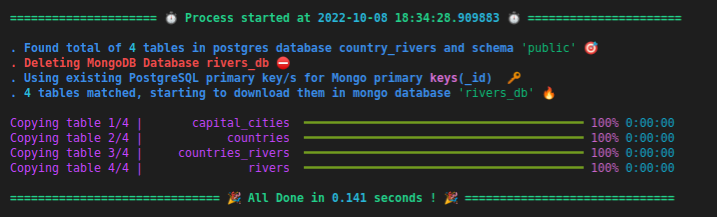
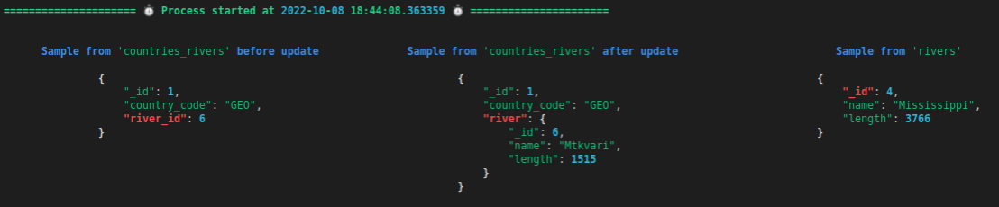
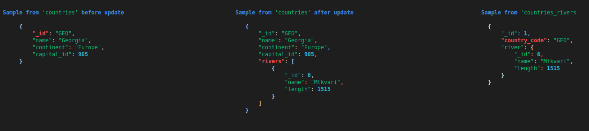
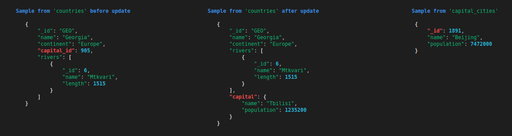
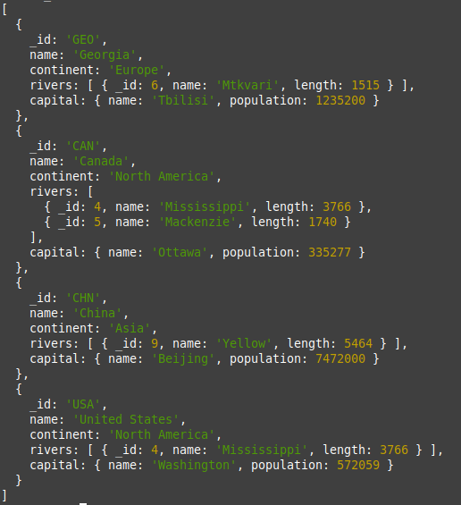

# Module allows to

- [x] Easily copy data from postgres database to mongodb.

- [x] Denormalize/Reshape data saved in step 1 to make it better stored in MongoDB, like adding nested objects from other collection for 1 to many relationships, so that we can avoid joins in queries e.t.c

# examples & howtos

## 1. data import example from PostgreSQL to MongoDB

To import data from any(local/remote) PostgreSQL database to any (local/remote) MongoDB, pass the appropriate parameters and relax while looking live progress in shell.  
 In the example that follows, most code is comment to explain what can be customized and how, so do not be intimidated by the length of just one function call:

```python

from importer.copy.basic_copy_importer import do_basic_import

# Postgres connection info
pg_params = dict(
    # from which database to copy data? | if database does not exist, you will get error
    database="some_database",
    # where is Postgres running? example if running on remote server: http://your_server_ip_address_or_domain
    host="localhost",
    # port where postgres is running. Make sure port is open and accessible from your PC
    port=5434,
    # user to authenticate
    user="some_postgres_user",
    # password to authenticate
    password="some_postgres_user_password",

    # # optional, if not set, you may not be able to find/copy tables that you need if they
    # # are not in default 'public' schema.
    # schema_name="public_or_something_else",
)

# Mongo connection info
mongo_params = dict(
    # host where mongodb is running
    host="localhost",
    # and port
    port=27017,
    # username to authenticate | not required if authentication is not needed
    username="john",
    # password to authenticate | not required if authentication is not needed
    password="strong_password",
)

do_basic_import(
    ######################
    # required arguments
    ######################
    postgres_params=pg_params,
    mongo_params=mongo_params,
    # which mongodb database to use to save data from postgres
    destination_db_name_in_mongo="data_from_postgres_or_some_more_descriptive_name",

    ######################
    # optional arguments
    ######################
    # do you want to clear contents of mongo datase before data retrieval starts? default is True,
    # so make sure it does not exist, or data in it is not useful or is backed up
    delete_existing_mongo_db=True,
    # if we do not want all tables from given postgres database and schema, list
    # or patterns for matching only some of them can be passed this way:
    tables_to_copy=["planets"], # any string here will be used as regex pattern, so
                                # in this case table with exact name 'planets' and other tables
                                # with 'planets' in their names will match(ex: 'solar_planets'),
                                #  of course if they exist in given database and schema.
    tables_not_to_copy=["user_", "country_"], # opposite of previous argument with similar syntax. here we filter
                                        # out some tables that matched previously so that  we get only tables we want.
                                        # in this example this way we will not download data for table 'user_planets'.
                                        # we can set tables_not_to_copy or tables_to_copy separately, both, or None.

    columns_to_copy = None, # dictionary with exact table names as keys and column name patterns list as values
                            # that we want to get. if set to None(default), all columns will be retrieved.
                            # ex: {"users": ["id", "^name$"] } - will get only column/s that contain "id" in them and
                            #  + one called "names" exactly, from "users" table.
    columns_not_to_copy = None,#  dictionary with exact table names as keys and column name patterns list as values
                            #  that we do not want to get. if set to None(default), all columns will be retrieved.

                            #  ex: {"users": ["id", "^surname$"] } - will not copy columns that contain "id" text in them,
                            #  or are exactly called "surname", so if we had columns ["id", "parent_id", "surname", "age"]
                            #  in a database, we will only get "age" field for each record.

                            #  as you probably guessed this patterns mechanism is very similar to tables_to_copy &
                            #  tables_not_to_copy arguments behaviour, but in this case as we need details about each
                            #  table, we use dictionary with exact table names as keys and desired patterns as values.

    # if set to True, for each row of postgres data, if it has primary key/keys, this key/keys
    # will be used to create similar field - '_id' in saved mongo data, so mongo will not autocreate
    # new _id fields for us and we will save some space. default is False.
    convert_primary_keys_to_mongo_ids=True,
)

```

After this you should see info about progress for each table that is being copied to mongo and the total number of them that we found in postgres.

For example:  


Another example output with a bit different supplied flags to do_basic_import function:  


If data is really large and network speed is not very high, process may take a looong time, but you can still do some tests with new data in mongodb as it arrives in 1000 row chunks at a time by default.

If something went wrong, follow the output and most probably you will quickly find incorrect credentials errors from pymongo(mongo) or psycopg2(postgres), if it is not the case, please open new issue, or contact me directly.

## 2. Data denormalization example in MongoDB

After we get data from Postgres, often we may need to transform it in a better shape to avoid joins in Mongo and this small function helps us to do this.

If you want some complex transformations, please just use MongoDB aggregation pipeline, as this library does not try to replace it.

Lets follow the example that is shown at the start of this README page, but in a bit more technical way.
Initially postgres database structure looks like this:


The goal is to just leave 1 'countries' table with all the data in it, without any foreign keys.
To achieve this goal, we combine data in tables 1 step at a time:

We start by importing all tables in MongoDB and automatically converting id fields to Mongo "\_id" fields.

```python
do_basic_import(
    postgres_params=local_rivers_db_postgres_connection_params,  # postgres connection params similar to what you saw before
    mongo_params=local_mongo_connection_params, # connection params for mongo
    destination_db_name_in_mongo="rivers_db",   # storing data in rivers_db database
    delete_existing_mongo_db=True,              # deleting database if exists
    convert_primary_keys_to_mongo_ids=True,     # so that fields will be indexed for us and no 'random' _id-s will be added
)
```



Now we have 4 collections in mongo with same names as in postgres. Lets start denormalization from harder part - make sure we have 'rivers' information embedded in 'countries' collection documents

```python
from importer.denormalize.denormalizer import denormalize_mongo

# move specific river info to countries_rivers and delete rivers table
denormalize_mongo(
    mongo_client=local_mongo_client,
    database="rivers_db",
    collection="countries_rivers", # we are adding data in this collection
    other_collection="rivers",     # from this collection
    field_name="river_id",         # using this field
    other_field_name="_id",        # when in other collection previous field matches this field value
    new_field_name="river",        # we get all such documents from other collection and save it under this key
    as_array=False,                # we know that we care only about 1 match in other table, so array is not needed
    delete_source_field_name_after_lookup=True, # we no longer need river_id anymore, as all needed data will be stored under new_field_name ('river')
    delete_other_collection=True,  # after operation, we do not need other collection, so delete it
)
```



after this, as you can see in CLI output image, our 'countries_rivers' now has 'river' key that stores specific river information and river_id field is removed.

Sample documents like this that are shown in CLI are random, so do not expect it to be correct, these documents just give us quick and easy way to look at changes and what caused that change. For example, we can clearly see red keys that are important and document structures before and after.

Great, not we to get rid of 'countries_rivers' and move its data to countries.

```python

denormalize_mongo(
    mongo_client=local_mongo_client,
    database="rivers_db",
    collection="countries",              # we are adding data to this collection
    other_collection="countries_rivers", # from this one
    field_name="_id",                    # using source field "_id"
    other_field_name="country_code",     # that must match to "country_code" field
    new_field_name="rivers",             # and storing matches in 'rivers' key
    as_array=True,                       # in this case, we expect more than 1 match, so store all as array
    delete_source_field_name_after_lookup=False, # deleting primary key field does not makes sense now
    delete_other_collection=True,        # but other collection will not be needed anymore
    leave_only_this_key_values_in_array="river",   # if you run code without this argument added,
                                        # result will be that "rivers" array field will be added
                                        # to each mongodb document in 'countries' collection, but as
                                        # full matched documents are added by default, we will have list/array
                                        # of objects with all keys found in each document of countries_rivers,
                                        # but we just want to save info for 'river' key for each document,
                                        # to achieve this, we use this argument and set it ti "river",
                                        # so that array now will contain only information that was present
                                        # in "river" key
)
```



Nice, now the only thing we do not like is capital_id, lets remove it and replace with corresponding capital info from 'capital_cities'

```python
denormalize_mongo(
    mongo_client=local_mongo_client,
    database="rivers_db",
    collection="countries",
    other_collection="capital_cities",
    field_name="capital_id",
    other_field_name="_id",
    new_field_name="capital",
    as_array=False,
    delete_source_field_name_after_lookup=True,
    delete_other_collection=True,
    do_not_copy_fields=["_id"],  # we do not want _id fields from 'capital_cities' to be stored in our new 'capital' key, so remove it this way
)


```

And we are done!



Now our 'countries' collection looks like this  


This exact example is implemented and tested in test_mongo_denormalizer\_\_skip_fields function in tests/test_mongo_denormalizer.py file, so for more info take a look at it.

#### If something is not clear about arguments/functions, please look at tests or function code/docs.

# installation

1. install poetry

```bash
python3 -m pip install poetry
```

2. from source folder with pyproject.toml file inside, run

```bash
poetry install
```

# running tests

1. make sure you have docker, docker-compose and make installed

2. run

```bash
make up
```

3. when output stops, press CTRL + C and then type

```bash
make test
```

or if you do not care about individual test outputs in CLI, then

```bash
make test_no_s
```

# supported Python versions

Developed on 3.10, should also work on earlier versions

# some thougts for future

. refine printed text location on screen(especially for mongo denormalizer)  
. add/replace some CLI prints with logging (?)  
. add continuation & live sync options (?)  
. test & support replicated/sharded clusters
